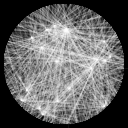
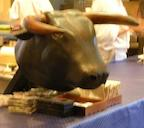

<link href="main.css" rel="stylesheet">

## Projects

Some generative art projects that I've made.

| | |
|:---:|:---:|
|  |  |
| [2019-09-04: Turing clouds](projects/turing-clouds/) | [2019-07-17: BZ reaction simulator](projects/bz/) |
|  |  |
| [2019-06-21: Fifty Ways to Draw a Circle](projects/50-circles/) | [2019-01-31: Stained-glass window generator](projects/glass/) |

---

## Meals

Writeups of some amazing meals I've had. These are from several years ago,
since I'm not so much into making public writeups of meals anymore, but
creativity never goes out of style.

| | | |
|:---:|:---:|:---:|
|  |  |  |
| [2007-09-06: Alinea](meals/alinea/) | [2007-09-04: moto](meals/moto/) | [2005-05-25: elBulli](meals/elbulli/) |

