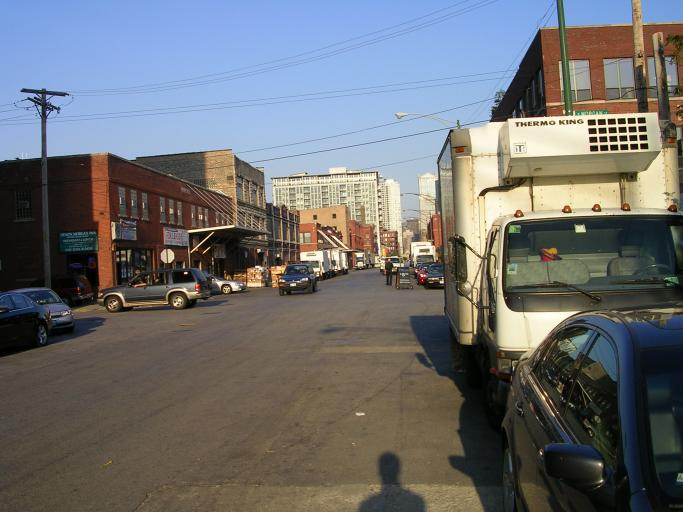

# Dinner at moto, September 4, 2007

Ever since my meal at [elBulli](../elbulli/) in May of 2005, I've been
itching for another great food experience.  We're blessed with lots of
great local food and terrific restaurants here in the San Francisco area,
but there isn't anything like elBulli here, as others have [complained](https://www.nytimes.com/2005/11/06/style/tmagazine/t_l_2192_2194_talk_tyranny_.html).
I did have dinner at the now-departed restaurants [Antidote](https://www.gayot.com/restaurantpages/SanFranciscoBayAreaInfo.php?tag=SFRES040606&code=)
and [Winterland](https://www.yelp.com/biz/9hd36WwU0SU_xWi-vXsX2g),
both of which took inspiration from the *nueva cocina* movement.  They were
good, but not nearly in the same league as EB.  I've heard interesting
things about [Coi](https://www.coirestaurant.com/), although I haven't been
there yet.  And I have really enjoyed the couple meals I've had at
[Manresa](https://www.manresarestaurant.com) -- they were among the very
best I've had in the Bay Area, and very creative -- but they didn't have
the same capacity to completely blow my mind.

While I was visiting my parents over Christmas in 2006, I was talking
with my friend Jesse, and lamenting how SF is a couple thousand miles
behind the leading edge of experimental cooking.  The leading edge in the
US, I mentioned, seemed to be in Chicago.  "Why Chicago?", he asked, being
the first of many to express surprise.  I don't think this is just coastal
prejudice talking, either -- the [City of the Big Shoulders](http://carl-sandburg.com/chicago.htm)
seems like it would have better things to do with its time than to cook up
bizarre new kinds of food.  I've been guessing that [Charlie Trotter](https://web.archive.org/web/20070928134910/http://www.charlietrotters.com/)
is the root cause of a lot of it, since he's been doing interesting and
creative cooking at his Chicago restaurant for 20 years now, and many of his
restaurant progeny have gone on to found other great restaurants.  But that's
just my speculation.

Anyway, Jesse was intrigued by my description and my excitement, and said
he'd be interested in joining me.  I started planning the trip after I got
back from vacation.  The hard part was, given our time constraints (three
nights' stay), how many places should I try, and which places should I
pick?  My experience at elBulli suggested that it's a good idea to leave a
"digestion" day after any big meal, so I opted for two fancy dinners: one
at [moto](https://web.archive.org/web/20070911055425/http://www.motorestaurant.com/flash/index.html),
the other at [Alinea](https://www.alinea-restaurant.com/).  We had
planned to go as soon as early April; it had to be rescheduled until September,
but eventually the occasion rolled around.  We found ourselves converging on
Chicago, Jesse from the east in Boston, I from the west, on a gorgeous
late-summer day.  The gorgeous weather was a stroke of luck, because our first
reservation was three hours after my plane was scheduled to arrive.  We met up
with Jesse's friend Josh, who lives in the area and had expressed interest in
trying some of this wacky food.

------------------------------------------------------------------------

moto is in a neighborhood where I wouldn't expect to find a restaurant:

There were almost as many delivery trucks as cars.  It seemed perfectly
safe, just a bit odd.

moto is in a row of three or four restaurants.  We originally poked our
heads into [otom](https://web.archive.org/web/20071025095021/http://www.otomrestaurant.com/),
thinking that moto was just the sort of place that might have a sign with the
name of their restaurant spelled backwards.  No, we were just being stupid;
moto was a couple doors down.  (otom is a related restaurant, though -- "the
comforting counter&nbsp;point <!-- [sic] --> to the exciting gastronomic
adventure of moto.")

Here's a look from our table at the interior of moto:

Classy but subdued decor.  There was background music playing all
night, a bit of an odd soundtrack ranging from bossa nova to rap.  We
listened and chatted while our "menus were being prepared."  I've had
special-meal menus before, but not like this:

The menu was brought to each of us on a foot-long plate, with a tiny
salad of potato cubes, corn, pine nuts, ch&egrave;vre, and microgreens on
the side.  The waiter pointed out that the menus definitely had been
printed especially for us:

and, of course, the menu was edible.  The waiter said he'd give us some
time to look over the menu, and he'd know we'd decided on our order once we
started eating it.  We already knew that we were going for the GTM ("grand
tour moto") -- I wasn't flying out from San Francisco to have an
abridged five-course meal -- but we tried nibbling the menus anyway.
They certainly were edible ... after a fashion.  The bottom layer was like
a thin cracker, and the top layer (where the menu had been printed) was
very, very salty.  Of course the point of an edible menu is to show that it
can be done, not to reach a perfect flavor balance, so I didn't really care
that it was so salty. I ended up nibbling mine down to the GTM section:

and left it like this on the side of the table, so I could see what was
coming.

------------------------------------------------------------------------

### Course 1: "Nitro sushi roll"

Our waiter referred to this as "sushi roll, deconstructed."  It had
chunks of raw salmon on the bottom, a chip like an Indian papadam, nori
powder, togarashi (five-spice powder), frozen sesame powder, and a stick of
pickled something (ginger?).  I'm always a fan of salmon, especially in
sushi, so I enjoyed this.  The flavors were like a spicy salmon roll
-- something (maybe the togarashi?) added a lot of heat.  The sesame
powder, which had been frozen with liquid nitrogen, provided an unexpected
balance against the heat.

------------------------------------------------------------------------

### Course 2: "Italian food"

A small, wide bowl with two soups: hot pizza soup and chilled Caesar
salad soup.  The pizza soup was thick, spicy like the dried pepper flakes
at a pizza parlor, and full of cheese and Italian sausage flavor.  The
Caesar salad soup was thin, tasted of garlic, lettuce, and a bit of
anchovies, and was topped with a couple small croutons.  I'm not sure
whether the white stuff drizzled on top was the source of the "dressing"
flavor.  Anyway, the flavors were remarkably true; this wasn't
fancy-schmancy "Italian food," but good, hearty "Eye-talian-American" food.
It was amazing how much of the pizza I could taste.  The cheekiness of the
dish got big laughs from the table.

Jesse and Josh got the wine pairings with this meal, and for this
course they provided a little pour of a dark beer -- so we could have
pizza and beer!

This got another round of laughter.

------------------------------------------------------------------------

### Course 3: "Red/yellow beet cake"

This was introduced as a course which would have us enjoying beets,
even if we didn't like them growing up.  Jesse and Josh already like beets,
and I think they're okay, so that wasn't a problem for us.  The dish was
many forms of red and yellow beets.  On the left was the piece of beet
"cake," only a bit sweet, which felt like a dense but foamy ice cream.
This was served with beet pur&eacute;es, pieces of raw beet, bacon, and
basil.  You can barely make out the yellow beet pur&eacute;e in my
low-light picture.  I enjoyed the unusual textures of beet by themselves,
but the bacon and basil really made the dish -- they contrasted with
the beet flavor nicely.

------------------------------------------------------------------------

### Course 4: "Ginger beer fizz"

We were presented with wine glasses with a bit of ginger syrup at the
bottom of each.  The waiter then took a syringe filled with a light
sarsaparilla solution and squirted the contents forcefully into each glass.
This produced a nice head of foam on the drink, though when we drank it,
the drink itself was confusingly not fizzy.  It was light, a bit tangy,
sweet but not too sweet; it also had what appeared to be little vanilla
flecks swimming throughout it.

------------------------------------------------------------------------

### Course 5: "Goat cheese snow"

Goat cheese which had been melted and then frozen in liquid nitrogen.
It was served with basil oil, so it ended up tasting like a nice pesto.
The "snow" was crumbly and cold, and melted to a very thin liquid in the
mouth; in texture it reminded me of the pine nut cheese that was part of
the [deshielo 2005](../elbulli/index.html#course14)
that I had at elBulli.

------------------------------------------------------------------------

### Course 6: "Caramel apple with bacon"

A half of a baked Gala apple, which had been partially hollowed out and
filled with caramel, peanuts, bacon, and applesauce made from the apple.
The streak on the "plate" is also applesauce.  The silverware for eating
the apple is specially designed to hold a sprig of sage; the scent of the
sage can contribute to the sensory experience of the dish.  It wasn't as
easy to take it all in as I would have liked -- the apple skin was a
bit tough to cut since we didn't get knives, and the sage was sticking out
the wrong end of the fork to really get much of the scent.  I ended up
sticking the sage end of the spoon undecorously under my nose while eating
forkfuls of the apple, but I didn't really mind because I thought the sage
added to the dish.  I really liked the flavor combinations -- a
gourmet caramel apple, balanced by the salt and depth of the bacon, and
lifted a bit by the sage.

When the waiters brought the dish out, they mentioned something in
passing about "battleship plates."  It took me a bit to understand what
they were talking about, but then it was obvious:

Oh, of course, [Battleship](https://www.boardgamegeek.com/game/2425) plates!

A closeup of the spoon.  The "screwy" side ended in a metal peg, which
plugged into a hole in the back of the "plate."

------------------------------------------------------------------------

Before the next course, a plate holding what appeared to be charcoal
briquettes was brought to the table.  The briquettes had been frozen in
liquid nitrogen (giving them a white/black mottling), and the plate they
were sitting on had a thin layer of high-proof alcohol which was
flamb&eacute;ed by the waiter.  They were left to sit for several courses,
without explanation.

### Course 7: "Greek salad"

The real seventh course was a tiny consomm&eacute; of cucumber, tomato,
red onion, and oregano, with a dot of extra-virgin olive oil.  Greek salad
is usually pretty strong, but this was mild enough to be a nice one-swallow
palate cleanser.  All the flavors shone through, despite the unassuming
appearance of the soup.

------------------------------------------------------------------------

### Course 8: "Bouillabaisse"

A rich, salty saffron broth, with a long saffron "tuile," New Zealand
cockles, and Prince Edward Island mussels.  The "tuile" was actually like a
long, thin, fishy pork rind; it didn't seem very strongly saffron-flavored.
The wine paired with this one was quite dry, which was a welcome complement
to the richness and saltiness.

------------------------------------------------------------------------

### Course 9: "Hamachi &amp; gumbo"

A piece of hamachi (yellowtail fish) that had been rubbed with spices
and set on a ceramic grate, served with a gumbo with abalone mushrooms.
The grate had been pre-cooled in liquid nitrogen, so it left white "grill
marks" on the fish when you picked the fish up!  Moreover, the parts of the
fish that had touched the "grill" made the fish feel more flaky and
cooked-textured, contrasting with the nearly sushi-like smoothness
elsewhere.  (The fish wasn't actually raw, but had been cooked in warm
olive oil.)  The gumbo was rich, fishy, sweet, quite spicy, and had a
strong paprika flavor.

I was really impressed by this course: the technical cleverness which
showed off an unexpected effect, the beautiful tenderness of the fish, and
and the well-balanced pairing of the fish with the soup.

------------------------------------------------------------------------

### Course 10: "Jalapeno &amp; lime"

A scoop of jalape&ntilde;o ice cream, cubes of avocado, toasted quinoa,
and a tequila-lime margarita sauce.  I thought it was okay; Josh said it
was his least favorite dish of the evening.  I don't think any of us would
have thought of "margarita" if it hadn't been mentioned.

------------------------------------------------------------------------

The restaurant, which was empty when we arrived for our 6:00 PM
reservation, was mostly full by this point.  Luckily, we weren't full at
all yet, because we were only half done with the meal.

------------------------------------------------------------------------

### Course 11: "BBQ pork with the fixin's"

The identity of the "charcoal briquettes" was revealed.  They were
rough-cut pieces of high-gluten Pullman bread, dipped in squid ink, toasted
in olive oil, then frozen in liquid nitrogen.  The waiter took two
"briquettes" and added them to each person's plate, which had a piece of
very tender pork, Kansas City-style barbecue sauce, and Pullman bread
pur&eacute;e.  This was another marvel.  The pork was fall-off-the-bone
tender, but didn't seem to actually have been barbecued.  (Maybe cooked
[sous vide](https://en.wikipedia.org/wiki/Sous-vide)?) The
briquettes, which had a nice toasty texture, seemed to add grill flavor
even though I knew it was squid ink.  My mouth and my eyes disagreed about
what was going on, but my mouth won.

------------------------------------------------------------------------

### Course 12: "Quail &amp; white truffle"

Despite the name, this was actually a take on macaroni and cheese.  The
small, warm glass had a piece of quail meat at the bottom, some cooked and
dehydrated macaroni, smoked cheddar pur&eacute;e, powdered truffle oil, and
chives.  The macaroni were unexpectedly crispy (but not rock-hard like
uncooked macaroni).  They played against the smooth, rich quail, the
richness of the cheese, some mysterious spicy heat, and the fumes of the
truffle oil brought out by the warmth of the glass.  It was some of the
biggest-flavored "comfort food" I've ever had.  Damn fine.

------------------------------------------------------------------------

### Course 13: "Steak &amp; eggs"

Deconstructed steak and eggs.  The cube on the left was steamed egg
white.  The egg yolk had been softly cooked, mixed with pur&eacute;ed
spinach, piped back into a hole in the middle, and topped with
micro-arugula.  The slices in the middle were tender prime rib with a
"smear" of shallot and mustard pur&eacute;e.  On the right was a "moto hash
brown" in a puddle of heirloom tomato pur&eacute;e.

I'm not much of a steak person myself, much less steak-and-eggs, so
this didn't do a whole lot for me.  The tomato pur&eacute;e tasted nothing
like ketchup, but was an intriguing alternative.

Josh contemplates his steak and eggs.

------------------------------------------------------------------------

### Course 14: "CO2 fruit"

A bunch of different things going on here.  Starting from the left,
there's a white rice "chip" with blackcurrant and butternut squash
flavoring powder, a cinnamon-infused apple slice and a vanilla-infused
asian pear slice underneath, chopped bits of black walnut, a cube of
carbonated watermelon, and a mixture of triple-creme cheese and white
chocolate.  I was really skeptical of the cheese and chocolate mixture, but
there was a surprisingly good balance between the two flavors, and it
served as a nice dip for the apple and the pear.  The apple and pear tasted
surprisingly natural -- again, a nice flavor balance.  And I don't
know how CO2 was used in most of the preparations, but it was
obvious with the watermelon cube: it had a wonderful, really potent fizz.
Apparently they just cut up cubes of watermelon and pumped carbon dioxide
into them, like how a water carbonation machine works.  Jesse mentioned
that he was installing a home carbonation machine, and said he'd definitely
have to try carbonating some watermelon.  This was one of his favorite
dishes.

Our waiter had told us earlier in the meal that he was actually a cook
too.  Many of the waitstaff at moto are first and foremost cooks, who are
assigned to do regular rotations working the front of the house.  As a
result, he was able to tell us a lot about the dishes, and he pointed out
that the flavored rice chip in this course was one of his inventions.  He
was also more excited about presenting the dishes than most waiters I've
seen; I think his approach would be out of place in some restaurants, but
it seems like a very natural thing when you put cooks out front.  It
reminds me of what happens in my line of work (software development) when
you send an engineer, rather than a salesman, to talk with a customer.  It
can be great for both people, but you have to be ready for it.

I did ask him why he thought Chicago was a hot spot for molecular
gastronomy, and he agreed that Charlie Trotter probably had a lot to do
with it.  So that's one hunch confirmed.

------------------------------------------------------------------------

### Course 15: "3 cotton candy stages"

Three unexpected forms of cotton candy.  The "paper" was completely
edible, made using super-secret technology of course, and tasted vaguely
but unmistakably like cotton candy.  The ball was made of white chocolate
and nonpareils, and had a cold thin liquid center that tasted of cotton
candy.  It was interesting, but the flavor of the liquid only lasted a
second or so, and was quickly replaced by the flavor of white chocolate.
(The nonpareils added an unexpected texture contrast.)  The "tangle" was
described as "fried cotton candy and cotton candy powder."  I sure can't
imagine frying any cotton candy I've ever seen, but whatever they did, it
was a hit.  It was an instant State Fair flashback -- pure cotton
candy flavor and a side of deep-fried deep fry.

------------------------------------------------------------------------

### Course 16: "Flapjacks prepared tableside"

We had been seeing a cold box get wheeled around all evening, and now
it was our turn to see it close up.  It was cooled from the inside by
liquid nitrogen (of course), and acted as a "griddle" on the top surface.
Our waiter poured three nickel-sized puddles of cr&egrave;me anglaise onto
the top of the box, waited a few seconds until they solidified, flipped the
"flapjacks," waited a few more seconds for the second side to "cook" ...

then picked each one up with a spatula and placed it quickly into a
waiting spoon.  The spoons had been prepared with a small puddle of rich
maple syrup in each one.  Another interesting illustration of what liquid
nitrogen can do -- the cr&egrave;me anglaise definitely had the
texture of a (really cold) cooked pancake!  This seemed like a direct copy
of the [Morphings](../elbulli/index.html#course26)
that I had at elBulli, but adapted to play up the breakfast food aspect of
the experience.  Lots of fun.

------------------------------------------------------------------------

### Course 17: "Carrot cake"

Freshly made carrot cake, served in several different forms: soup (!),
a tuile, croutons, and cream.  All four forms were not just carroty, but
carrot-cakey.  Since the croutons were made from carrot cake, they were
very dense and chewy.

------------------------------------------------------------------------

### Course 18: "Chicago dog"

By about this point in the meal, there was no question that we were
getting full.  Jesse had been looking at the "Chicago dog" lurking at the
end of the menu with a bit of indigestion; yes, things are different at
moto, and maybe it makes sense to have a big hunk of hot dog and fixin's at
the end of a meal, but it sure sounds like a gut bomb.  Of course, we had
nothing to fear.  The hot dog that we were served was about as long as my
thumb, and was strictly dessert: a muffiny brown-butter bun, a "hot dog" of
strawberry sorbet, a "tomato slice" of raspberry gelee, cubes of "relish"
made from green tomato gelee, asian pear "horseradish," and lemon curd
"mustard."  The strawberry sorbet had a strikingly realistic "hot dog end"
pattern on each side, adding to the realism.  The fruity flavors and the
chill of the sorbet were nicely refreshing, while the experience of looking
at what seemed to be a bit of aggressive street food and tasting refined
fruitiness kept us off guard.

------------------------------------------------------------------------

### Course 19: "Pina colada forms"

Rum ice cream, coconut foam, toasted coconut, and pineapple powder.
Pleasant, but the ice cream wasn't as rummy as I might have liked.

------------------------------------------------------------------------

### Course 20: "Chili-cheese nachos"

We'd been looking at this one with as much trepidation as the "Chicago
dog," and again, we had nothing to worry about.  The "nacho" was a bit of
sweetened corn tortilla; it was topped with chocolate "ground beef," "Pace
picante sauce" of strawberries, and mango "cheese."  Another good round of
laughs for this one.  The chocolate was strong and tasty, which normally I
don't mind at all, but here it took away a bit from the rest of the dish,
which was cool and light and refreshing.

As "mignardises," we got some packing peanuts:

These were a lot like the biodegradable packing peanuts, but made with
vanilla cr&egrave;me anglaise and vanilla sugar.  I've never eaten one of
the real peanuts, but I suspect this one was better than most.

------------------------------------------------------------------------

Quite a meal.  We went back to the hotel full and beaming.  We played
tourist for a couple days, seeing the city by foot and by El, and sweating
off the remains of our big meal in the hot and humid Chicago summer.  By
Thursday evening we had walked enough, and were ready and excited for our
trip to [Alinea](alinea.html).

