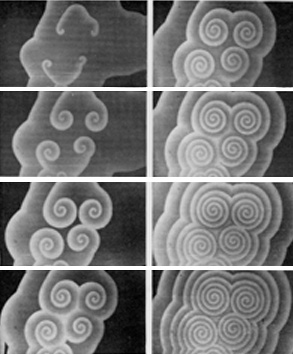

# A simple BZ reaction simulation  

## Background

The Belousov-Zhabotinsky (or "BZ") reaction is a non-organic chemical
reaction known for having a steady-state oscillatory behavior.  The initial
discovery came from a mixture of chemicals that oscillated in color between
yellow and clear. Other forms of the reaction that take place on a surface
(such as in a Petri dish) spontaneously evolve moving spiral patterns.

  

(Image from Zhabotinsky A. M. and Zaikin, A. N., _Spatial effects in a
self-oscillating chemical system_, in Oscillatory processes in biological
and chemical systems II, Sel'kov E. E. Ed., Science Publ., Puschino, 1971.)

Many people have tried to characterize this behavior. The [FKN
model](https://pubs.acs.org/doi/abs/10.1021/ja00780a001), described by
Field, Kőrös, and Noyes in 1971, proposed a set of ten reactions. Two
years later, Field and Noyes proposed a simplified five-reaction model
called [the Oregonator](https://pdfs.semanticscholar.org/fa74/3e39198cfc0c58f46ac63abb70fe8cd030d6.pdf). A paper published in 1990 described [80 distinct
reactions](https://pubs.acs.org/doi/abs/10.1021/j100381a039) that might be
involved in the process.

## Simple model

Much more recently, Alasdair Turner described a [very simple
model](http://discovery.ucl.ac.uk/id/eprint/17241) of the reaction by
reasoning from first principles. This model doesn't attempt to capture the
detailed dynamics of the actual chemicals involved in the BZ reaction, but
it has the advantage of being extremely simple to reason about. It starts
by imagining a set of three reactions:

> A + B &rarr; 2A  (proceeds at rate &alpha;)
>
> B + C &rarr; 2B  (proceeds at rate &beta;)
>
> C + A &rarr; 2C  (proceeds at rate &gamma;)

Consider the amount of A present at some point in time.  The first reaction
increases the amount of A based on the amount of B, and the last reaction
decreases A based on the amount of C.

Modeling this as a time-step rule would give:

> At+1 = At + At * (&alpha; * Bt - &gamma; * Ct)

The first At describes the amount present at time t. Most of it
will still be present at time t+1. The first reaction produces A at the
rate &alpha; * At * Bt, due to the [Law of mass
action](https://en.wikipedia.org/wiki/Law_of_mass_action). Similarly, the 
last reaction consumes A at the rate &gamma; * At *
Ct. That accounts for all the parts of the time-step rule.

By symmetry, then, there are three rules that describe the three different
chemicals:

> At+1 = At + At * (&alpha; * Bt - &gamma; * Ct)
>
> Bt+1 = Bt + Bt * (&beta; * Ct - &alpha; * At)
>
> Ct+1 = Ct + Ct * (&gamma; * At - &beta; * Bt)

The last important bit of this model involves thinking about what happens
when these reactions take place on a flat surface, rather than in a
well-stirred beaker. Some mixing will take place due to [diffusion
processes](https://en.wikipedia.org/wiki/Reaction%E2%80%93diffusion_system),
but that only has local effects. So when figuring the concentration of A
*in some specific place* at time t+1, the values of At,
Bt, and Ct should be averaged over some set of
neighboring places.

## My implementation

Turner's [paper](http://discovery.ucl.ac.uk/id/eprint/17241) includes a
basic implementation of this process in [Processing](https://processing.org/). 
It follows some basic principles of two-dimensional [cellular
automata](https://en.wikipedia.org/wiki/Cellular_automaton) such as
Conway's [*Game of
Life*](https://en.wikipedia.org/wiki/Conway%27s_Game_of_Life). These
systems keep one or more values per pixel, and part of taking a time step
involves summing the values in the nine-pixel box around each pixel.
Turner's implementation maintains concentrations of A, B, and C for each
pixel, and averages those concentrations when taking a time step. The
image that it produces is colored based on all three concentrations,
mapping A to red, B to blue, and C to green.

I decided that this would be interesting to play with, so I made [a version
of my own](.). My version allows the reaction rates to be controlled
dynamically, and it allows reagents to be added and removed from the system.
Standard RGB computer graphics limits the number of reagents that can be
visually displayed at any point in time to three, but adding more reagents
can still show interesting effects.

There are a lot more interesting directions this could be taken in. I
haven't seen any time-step simulation using the Oregonator model, and I'd
be curious to see how this one compares. I'd also like to trace the path of
several pixels over time, and see if it actually has a chaotic attractor
similar to what the original system has. And it would be great to find
visually interesting ways of representing concentrations of more than three
reagents. But the current thing just seemed worth creating on its own.
