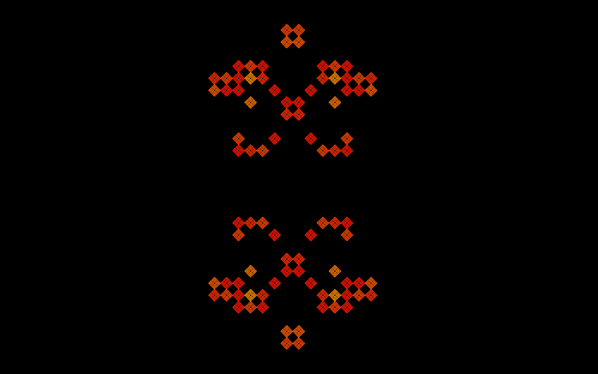

## Conway's Game of Life using `wgpu`

This is an implementation of [Conway's Game of
Life](https://en.wikipedia.org/wiki/Conway%27s_Game_of_Life).
There are many implementions out there already; this one is written in
Rust using the [wgpu](https://wgpu.rs/) library. It's intended to be a
demo of how to use a [compute
shader](https://www.khronos.org/opengl/wiki/Compute_Shader) together with a
[fragment shader](https://www.khronos.org/opengl/wiki/Fragment_Shader) to
create pixel-granularity generative art using `wgpu`.

I'm excited about `wgpu` because it allows programs to be compiled into
[WebAssembly](https://webassembly.org/), which means they can be run in a
browser. Right now (July 9, 2021), browser support for this is under active
development, which in practice means that it only works using pre-release
versions of the browser, and then only sometimes. So for now, here's a
snapshot from the running system:

I'll update this page to use the WebAssembly version once that's available.

The colors are inspired by the old Sun screensaver version of Life:

where cells start out red and move along the rainbow toward blue/purple as they
age.

The source code is available on [Github](https://github.com/blakej11/wgpu-life).
