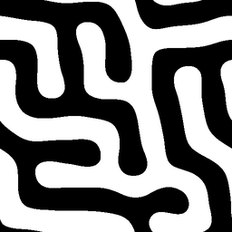
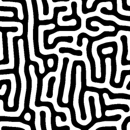
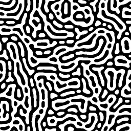

## Turing clouds - how they work

These are some of the ideas and other systems that went into creating Turing
clouds.

### Turing's original model

After Alan Turing had [established the foundations of computer
science](https://en.wikipedia.org/wiki/Turing%27s_proof) and
[helped break the German Enigma
cipher](https://en.wikipedia.org/wiki/Cryptanalysis_of_the_Enigma) during
World War II, his interest turned to biology.  One of his last published
papers was titled [The chemical basis of
morphogenesis](https://doi.org/10.1098/rstb.1952.0012) (PDF
[here](http://www.dna.caltech.edu/courses/cs191/paperscs191/turing.pdf)).
This paper proposed a model for how biological systems might develop striped
or spotted patterns, such as those you see on a zebra or a leopard.

To get the basic intuition behind Turing's model, imagine a flat surface
with two chemicals, an "activator" and an "inhibitor", diffusing across it
at different rates.  You can imagine this taking place in the real world
across the skin of a growing animal.  In locations where there is more of
the activator than the inhibitor, the activator creates more of itself as
well as more of the inhibitor, and it causes pigmentation (such as a black
spot or a stripe).  In locations where there is more of the inhibitor than
the activator, some of each is destroyed, and no color change happens.

Turing showed that this simple interaction of chemicals should lead to
regularly spaced patterns, with the details of the patterns depending on
the exact diffusion rates.  As of 2019, we don't know of any biological
system where Turing's model has been conclusively shown to be the source
of a pattern, but the model [has been demonstrated to produce
patterns](https://www.ncbi.nlm.nih.gov/pubmed/10041855) in an actual
chemical system.

### Jonathan McCabe's multi-scale patterns

In 2010, Jonathan McCabe wrote a
[paper](http://www.jonathanmccabe.com/Cyclic_Symmetric_Multi-Scale_Turing_Patterns.pdf)
describing a simple way to simulate Turing's model on a computer, and a
tweak to that model which led to startling visual patterns.

The simulation follows the general format of a [reaction-diffusion
system](https://en.wikipedia.org/wiki/Reaction%E2%80%93diffusion_system).
Create a grid of numbers, where each entry in the grid has a value between
-1 and 1.  The value can be thought of as the difference between the amount
of activator and inhibitor chemicals at that grid location.  The system
evolves from one timestep to the next by simulating diffusion and then
modeling the reaction of the diffused chemicals.

To simulate diffusion at a given cell, take the average value of all grid
locations within a fixed radius of that cell.  Averaging over a larger
radius corresponds to having a faster diffusion rate, because there are
more cells contributing to the new value.  In the Turing reaction,
activators and inhibitors diffuse at different rates, which corresponds to
taking averages over different radii.

To simulate the reaction, take the difference of the newly calculated
averages from the activator and the inhibitor.  If the result is positive,
increase the current cell's value slightly, and if it's negative, decrease
the cell's value slightly.

Once this has been done for all cells in the grid, the image can be
generated.  Color each pixel in the image based on the corresponding cell's
new value: a value of -1 yields a black pixel, +1 yields a white one, and
anything in between uses the corresponding greyscale value.

The following images are a few examples I generated of this kind of system:

| | | |
|:---:|:---:|:---:|
|  |  |  |

McCabe also suggested that one could simulate more than one of these
reactions on a given system at a time, using different radii for each
reaction. If you do this, and you add the results together, you can get
patterns that look like stripes made of spots. But he also observed that
a slight tweak to this approach gives a much more visually striking result.
Instead of simply adding the results together, his system updates the value
of the cell based on which pair of radii has the smallest difference.  This
seems to constantly add instability to the system, and it yields images
with fractal-like detail and a strong biological character.  Here's a
characteristic example:

### Thinking about speed and color

I was captivated when I first discovered this system.  As with the
[Mandelbrot set](https://en.wikipedia.org/wiki/Mandelbrot_set) back in the
1990s, I found it amazing that such a simple system could generate such
visual complexity.  But this system would have been unusably slow to
implement back in the days of
[Fractint](https://en.wikipedia.org/wiki/Fractint). A single timestep takes
O(`W * H * R^2`) time to calculate, using a naive implementation, and the
largest radius `R` can be a substantial fraction of the image's width `W`
or height `H`.

Even on a modern computer, this isn't a fast operation. The first
implementation I found, which was in the reaction-diffusion modeling system
[Ready](https://github.com/GollyGang/ready), only generated a few 512x512
images per second on my laptop. It takes quite a while to see how the
system evolves when it's going at that rate. So that got me to start
writing my own implementation, first as a multi-threaded CPU-based program,
then once again as a GPU client using OpenCL.

Once I had my own version to play with, I started wondering what this
system would look like if it were colored - or, for that matter, what it
would even mean to try to add color to it.  One of my early attempts was
vaguely reminiscent of a lava lamp:

<iframe src="https://player.vimeo.com/video/356914126" width="640" height="360" frameborder="0" allow="autoplay; fullscreen" allowfullscreen></iframe>

and that was fun, but ultimately not that satisfying.  Eventually, the
[ghost of Claude Shannon](https://en.wikipedia.org/wiki/Information_theory)
tapped me on the shoulder and pointed out that I wasn't going to get
the full range of colors in a [three-dimensional color
system](https://en.wikipedia.org/wiki/Munsell_color_system) if I only had
one value per pixel.

I read a blog post that Jason Rampe
[wrote](https://softologyblog.wordpress.com/2016/11/17/more-experiments-with-coupled-cellular-automata/)
about an approach he'd taken to colorizing multi-scale Turing patterns, but
he pointed out that it's much better suited for single-frame images rather
than movies, because it changes drastically from frame to frame.  Since I
had already been aiming at creating an implementation that could create
smoothly flowing images, I decided that wasn't the approach for me.

### Adding color by using vectors

I decided to aim for a very straightforward extension of the multi-scale
algorithm, by letting each cell have a vector of data rather than just a
scalar, and reinterpreting the multi-scale algorithm to use vector
arithmetic.  This gave me a three-dimensional vector, contained within the
unit sphere, that I could try to turn into a color.  But I was disappointed
to find that I couldn't find a way to make those values look good, even
after converting into spherical coordinates which would fit the data more
naturally.  The radius, which is the analogue of the only component of the
black-and-white Turing patterns, was too visually dominant in the vector
version to be useful.  And if I just discarded it, I would only have two
values to work with.

So I tried four-dimensional vectors.  Although that gave me enough data to
work with, I was still reluctant to discard the radius, since without it
the images looked totally unlike the black-and-white multi-scale patterns
that I started with.  Ultimately I decided that what I found was more
compelling than a colorized version of the original pattern, and I stuck
with it.  Here's an example:

### Visualizing the data directly

As I was playing with different ways to turn a vector into a color, I had
several occasions where I wanted to look more directly at the data.  Simple
histograms of each axis didn't tell me very much, so I made a 2-D "heatmap"
by projecting the 4-D data onto a plane, and using the pixel color to
represent how many 4-D data points mapped onto a given point in the plane.
Not only was this a useful debugging tool, I quickly noticed that the
heatmap was at least as visually interesting as the color rendering itself.
The 4-D object that it shows bears some resemblance to a [strange
attractor](https://en.wikipedia.org/wiki/Attractor), but it also shifts
around in space as the system evolves.  The shifting, complex shape of
these objects inspired the name "Turing Clouds".

Here's what the previous image looks like in heatmap mode:

The ravioli-like shapes from the color rendition are visible as thin films
within the overall cloud of data.

### Interacting with the data

During the development of my GPU-based implementation, I came across a
paper by Aubrey Jaffer titled [Oseen Flow in Ink
Marbling](https://arxiv.org/pdf/1702.02106v1.pdf).  It describes the
dynamics of a system where a finite-length stroke is made within a liquid
with some viscosity, such as what you might do when creating [ink marbling
patterns](https://en.wikipedia.org/wiki/Paper_marbling).  This seemed like
a fun way to interact with my visualization, so I added support for it.
It treats mouse movements as strokes, and the result can wind up feeling
like finger painting using very surprising colors.  Here's an example,
created by drawing a few spiral strokes in an existing image:

I've also added support for capturing an image using a connected camera,
and letting the system evolve starting at that image.  The results can be a
bit uncomfortable to look at!

There are several tunable parameters involved in generating an image.  They
can each be controlled by individual keystrokes, but there is also an
"autopilot" mode running by default which tweaks the parameters
occasionally to keep the display interesting.

### Speed

As mentioned above, I had a goal of making my software operate fast enough
that I could interact with it in real time.  It takes some decent graphics
hardware to make that happen, but I've achieved it.  The software can
render full HD (1920x1080) at 15 fps on an AMD Radeon 570, and at 20 fps
(very nearly 30 fps) on an NVidia 1060; these are both fast enough to be
fun to interact with.  A 2016 MacBook Pro can get around 5 fps running
full-screen with just the built-in graphics hardware, which is just fine
for development and experimenting.
