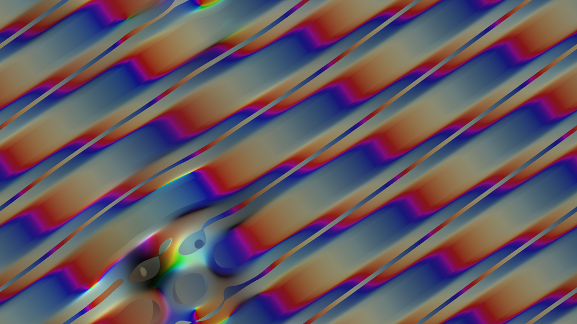
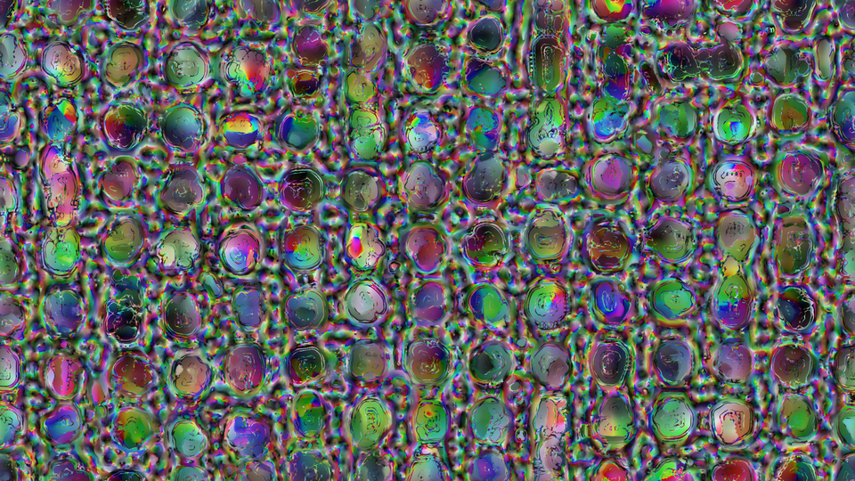
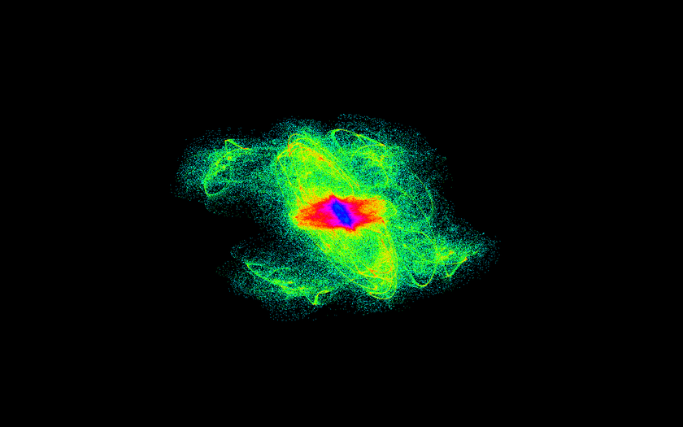
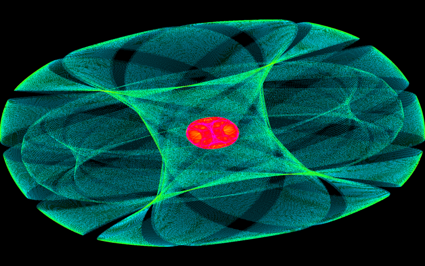

# Turing clouds - images

All images on this page are half-sized.  [Click here](fullsize.html) to see
all full-sized images on a single page, or click any individual image to
see it at full size.

## Color rendering

These are all images that evolved from random noise.  The only human
intervention was parameter selection, and in many cases those were chosen
randomly as well.  The first image is a fairly standard example of what
this system looks like.

## Black-and-white

These are images from rendering Jonathan McCabe's original (1-D) multiscale
Turing pattern.  The first image is a fairly standard example of what that
system looks like.

## Heatmap visualization

Some examples of color images along with the heatmap visualization of the
data that generated it.

Some standalone examples of heatmaps:

## Mouse interaction

These are some images of the color system with some mouse movement added.

