## Turing clouds

This is my adaptation of [Jonathan McCabe's multi-scale Turing
patterns](http://www.jonathanmccabe.com/Cyclic_Symmetric_Multi-Scale_Turing_Patterns.pdf)
which adds smooth color, interactivity, a new visualization style, and
real-time rendering speed.

I have a detailed description of [how it works](background.html), and you
can look at the [code](https://github.com/blakej11/turing-clouds) as well.
But you might also just want to see what it does.

## Videos

Here are some videos of the system in action.

<iframe src="https://player.vimeo.com/video/356804717" width="640" height="360" frameborder="0" allow="autoplay; fullscreen" allowfullscreen></iframe>

<iframe src="https://player.vimeo.com/video/356831760" width="640" height="360" frameborder="0" allow="autoplay; fullscreen" allowfullscreen></iframe>

<iframe src="https://player.vimeo.com/video/356807696" width="640" height="360" frameborder="0" allow="autoplay; fullscreen" allowfullscreen></iframe>

<iframe src="https://player.vimeo.com/video/356922295" width="640" height="360" frameborder="0" allow="autoplay; fullscreen" allowfullscreen></iframe>

&nbsp;

## Images

These are some sample images created by the system. Click on any image to
see it at full size. You can also see all images on a single page - in
half-size [here](halfsize.html), and full size [here](fullsize.html).

### Color rendering

| | | | |
|:---:|:---:|:---:|:---:|
| [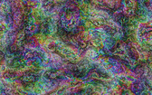](images/100/regular/0000187.png) | [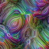](images/100/regular/0000530.png) |  | [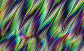](images/100/regular/0002792.png) |
| [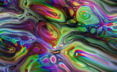](images/100/regular/0003362.png) | [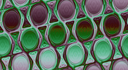](images/100/regular/0003594.png) |  |  |
| [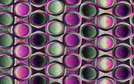](images/100/regular/0010445.png) | [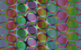](images/100/regular/0013306.png) |  |  |
| [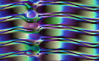](images/100/regular/0026923.png) | [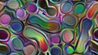](images/100/regular/0030150.png) | [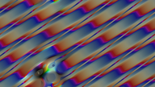](images/100/regular/0030205.png) | [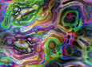](images/100/regular/0033784.png) |
| [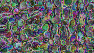](images/100/regular/0038413.png) | [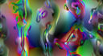](images/100/regular/0039418.png) | [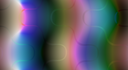](images/100/regular/0040017.png) | [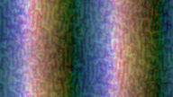](images/100/regular/0043112.png) |
|  | [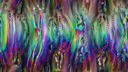](images/100/regular/0052704.png) | [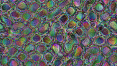](images/100/regular/0070989.png) |  |
| [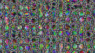](images/100/regular/0174796.png) | [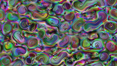](images/100/regular/0220953.png) | [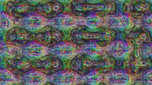](images/100/regular/0266840.png) | [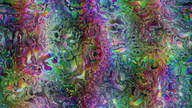](images/100/regular/1092273.png) |
| [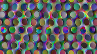](images/100/regular/2284302.png) | | | |

&nbsp;

### Black-and-white (multi-scale Turing patterns)

| | |
|:---:|:---:|
| [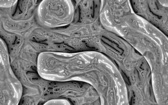](images/100/bw/0006144.png) | [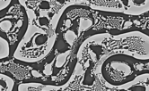](images/100/bw/0002184.png) |
| [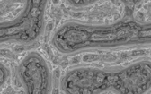](images/100/bw/0005131.png) | [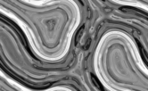](images/100/bw/0007354.png) |
| [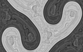](images/100/bw/0016173.png) | | | |

&nbsp;

### Heatmap visualization

| | |
|:---:|:---:|
| [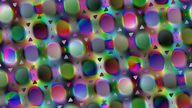](images/100/4d/0006230.png) | [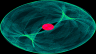](images/100/4d/0006229.png) |
| [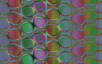](images/100/4d/0013619.png) | [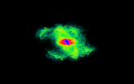](images/100/4d/0013618.png) |
| [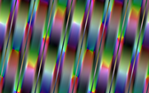](images/100/4d/0024478.png) | [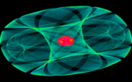](images/100/4d/0024480.png) |
| [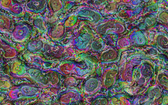](images/100/4d/0000425.png) | [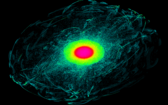](images/100/4d/0000424.png) |
| [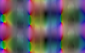](images/100/4d/0002135.png) | [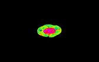](images/100/4d/0002134.png) |
|  | [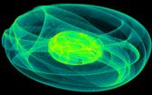](images/100/4d/0002398.png) |
|  | [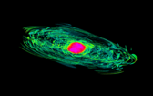](images/100/4d/0002701.png) |
| | [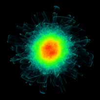](images/100/4d/0001284.png) |
| |  |

&nbsp;

### Mouse interaction

| | |
|:---:|:---:|
| [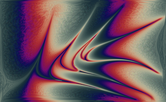](images/100/stroke/0001495.png) |  |
| [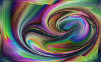](images/100/stroke/0024517.png) |  |
| [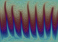](images/100/stroke/0066382.png) | [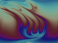](images/100/stroke/0073536.png) |
